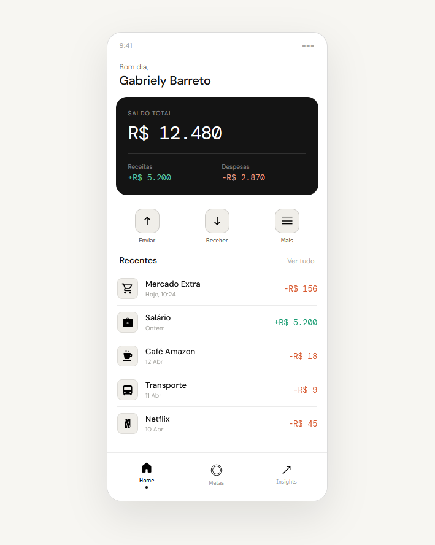
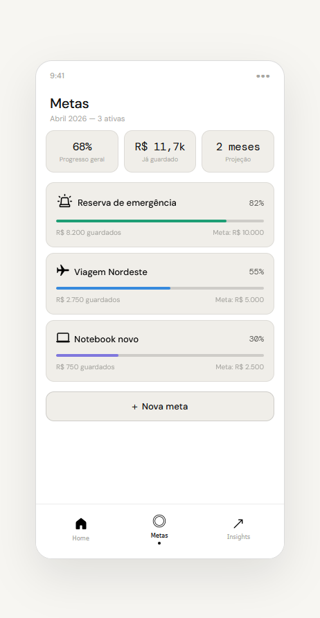
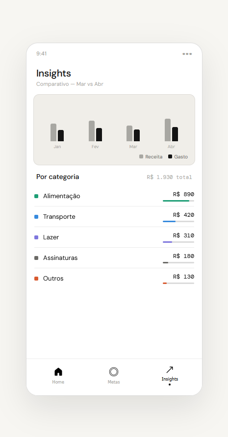

# Finance App (Fullstack)

Aplicação de finanças pessoais **fullstack**, desenvolvida com **React + Vite no frontend** e **Java (Spring Boot) no backend**, com persistência em banco de dados **MySQL**.

O projeto tem como objetivo permitir o controle de receitas e despesas de forma simples, com interface moderna e API estruturada seguindo boas práticas de desenvolvimento.

---

##  Demonstração

  
  
  

---

## Funcionalidades
- Cadastro de receitas e despesas
- Categorização de transações
- Cálculo automático de saldo
- Histórico de movimentações
- Filtro por tipo e categoria

###  Backend
- API REST para CRUD de transações
- Arquitetura MVC
- Integração com banco de dados MySQL
- Validações de dados

---

##  Tecnologias utilizadas

### Frontend
- React
- Vite
- Axios
- CSS 

### Backend
- Java
- Spring Boot
- Spring Web
- Spring Data JPA
- MySQL

---

## Autora

Desenvolvido por Gabriely Barreto
